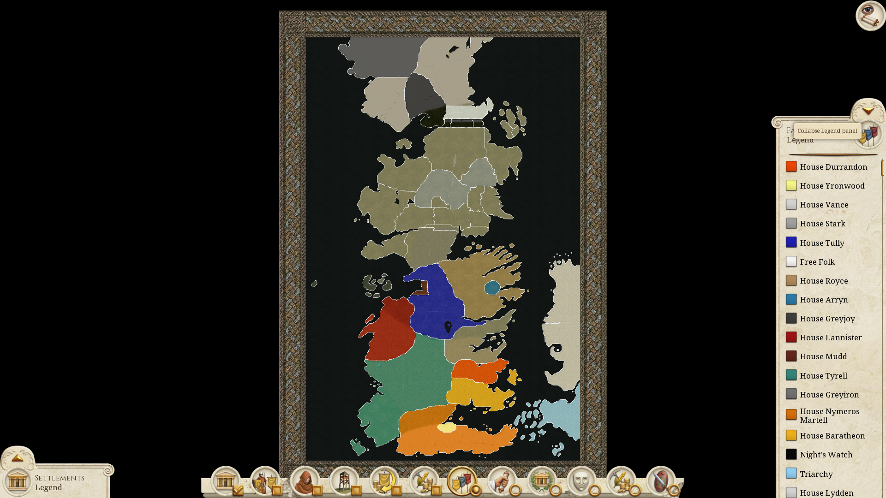
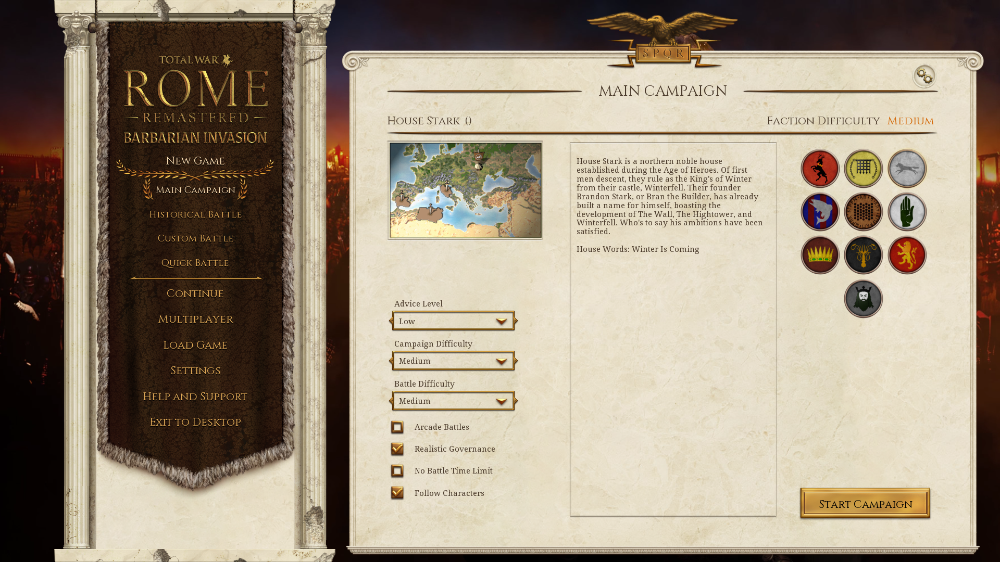
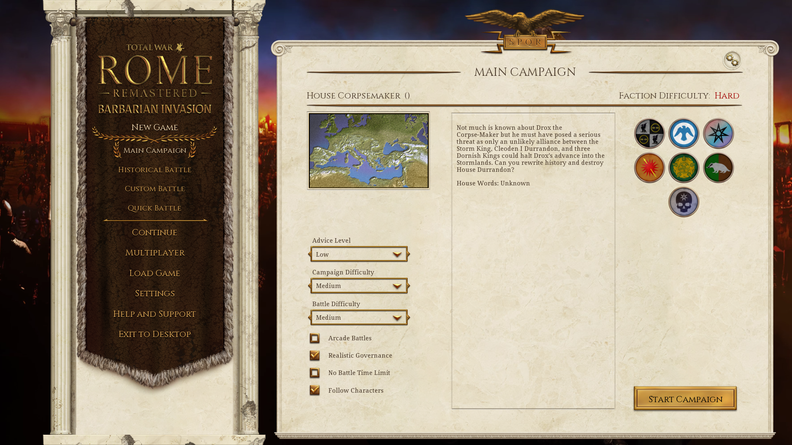
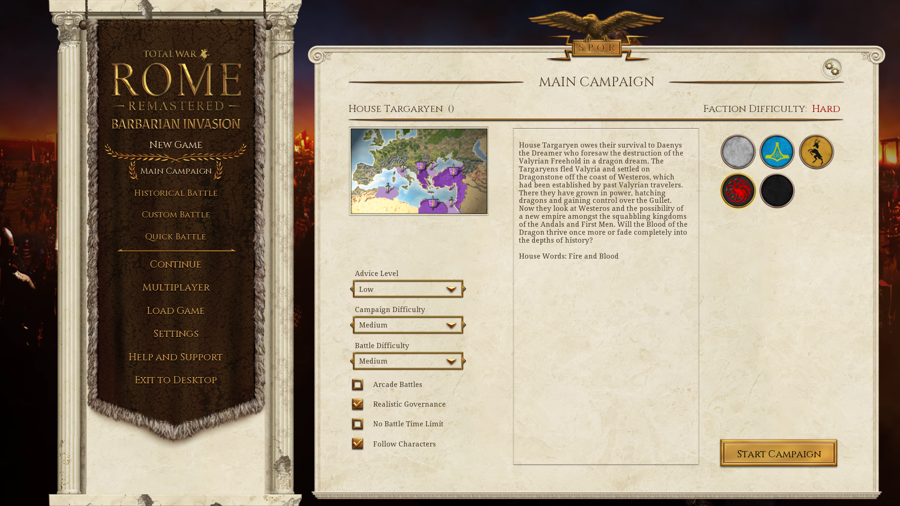
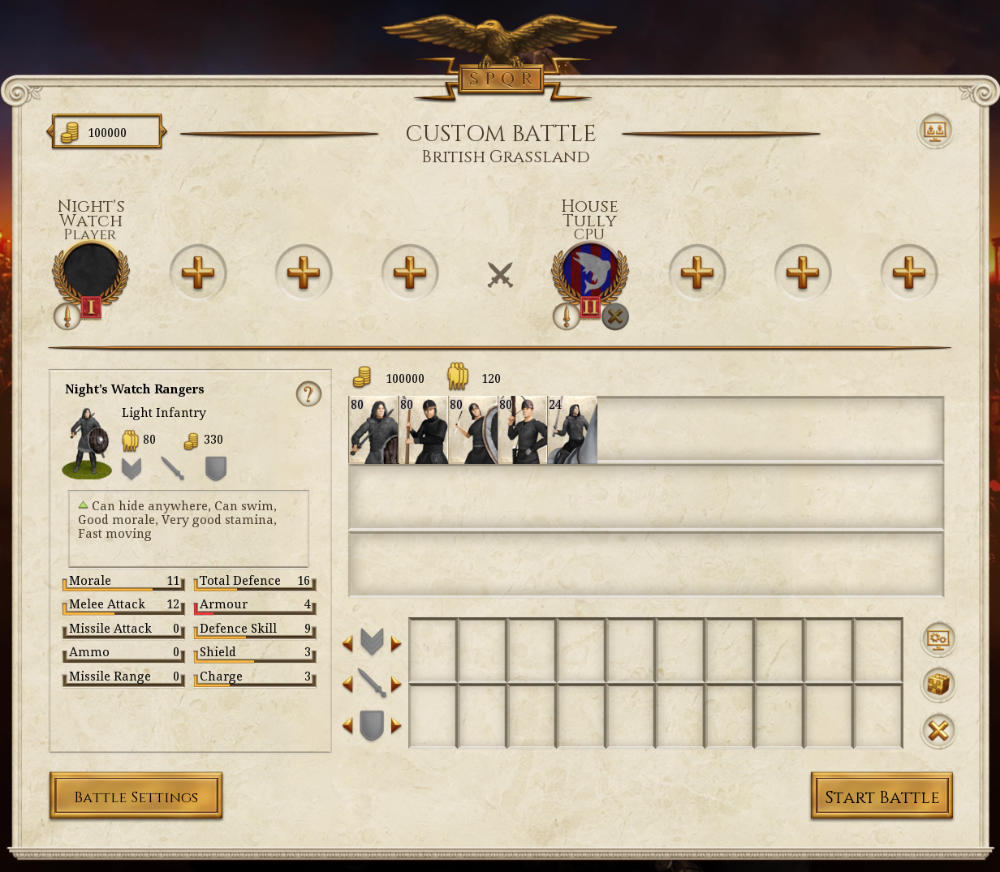
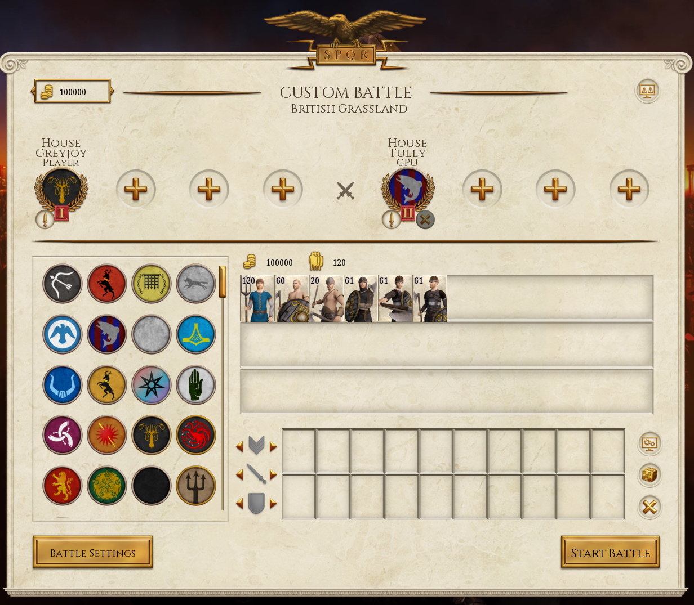
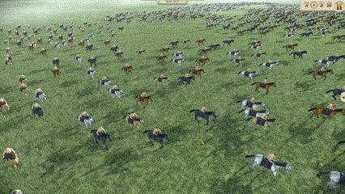
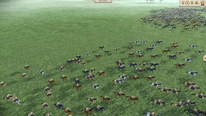

# Age of Heroes: Total War
A Rome Total War Remastered Overhaul Mod based on the A Song of Ice and Fire (ASOIAF) Universe. The mod will maximize the features available in Rome Remastered and take creative liberty to create a gameplay experience with a clear goal that is flush with challenging emergent events following the ASOIAF lore. Pick your house and find glory!

This mod's goal is to create a more dynamic, challenging, and full-body experience. The original Rome Total War features many static factions and often turns into an all-out-attack sprint through the map. By introducing emergent factions and events, this mod will force the player to not only attack in all directions but also defend from all directions.

## Table of Contents
- **[Map](#map)**
- **[Factions](#factions)**
  - **[First Men Houses](#first-men-houses)**
  - **[Andal Houses](#andal-houses)**
  - **[Andal Houses](#andal-houses)**
  - **[Other Factions](#other-factions)**
  - **[Cadet Houses](#cadet-houses)**
- **[Events](#events)**
  - **[Major Events](#major-events)**
    - **[Coming of the Andals](#coming-of-the-andals)**
    - **[Targaryen Conquest](#targaryen-conquest)**
    - **[Triarchy Invasion of the Stepstones](#triarchy-invasion-of-the-stepstones)**
    - **[The Long Night](#the-long-night)**
  - **[Minor Events](#minor-events)**
    - **[King-Beyond-the-Wall](#king-beyond-the-wall)**
    - **[Nymeria's War](#nymerias-war)**
    - **[House Tully](#house-tully)**
    - **[House Tyrell](#house-tyrell)**
- **[Faction Unique Gameplay Mechanics](#faction-unique-gameplay-mechanics)**
  - **[Night's Watch](#nights-watch-gameplay)**
    - **[Night's Watch Units](#nights-watch-units)**
    - **[Night's Watch Castles](#nights-watch-castles)**
  - **[Free Folk](#free-folk-gameplay)**
  - **[Triarchy](#triarchy-gameplay)**
- **[Gameplay Features](#gameplay-features)**
  - **[The Royal Line](#the-royal-line)**
  - **[Legitimized Bastards](#legitimized-bastards)**
- **[Images](#images)**
  - **[Free Folk Warriors](#free-folk-warriors)**
  - **[Iron Islands Roster](#iron-islands-roster)**
  - **[Dothraki Charge](#dothraki-charge)**

## Map
The strategy map will encompass Westeros from Dorne to Thenn beyond the wall. The map will also include the west coast of Essos and a few of the Free Cities, but these will not be important to gameplay. Expansion of the map has been thought about, but as you will read later, the need for more factions would scale development exponentially. Warfare between Essosi and Westerosi factions will instead be implemented through major events.

## Factions
Factions will continue to be expanded once initial mod development has been completed. The initial goal is to replace all 20 vanilla factions with ASOIAF Houses and Factions, plus a few additional factions. Here is the list of initial planned factions.
### First Men Houses
From Left-to-Right, Top-to-Bottom: House Durrandon, House Yronwood, House Stark, House Tully, House Royce, House Gardener, House Mudd, House Greyjoy, House Lannister, House Greyiron

### Andal Houses
From Left-to-Right, Top-to-Bottom: House Vance, House Arryn, House Sevenstars, House Lydden, House Nymeros-Martell, House Tyrell, House Lydden, House Corpsemaker

### Other Factions
From Left-to-Right, Top-to-Bottom: Free Folk (Clans will initially be part of the rebel faction before being implemented as factions), The Triarchy, House Baratheon, House Targaryen, The Night's Watch 

### Future Factions
Future factions are in future plans. The number of factions possible to implement from the lore is expansive, and focus will be placed on other items first to prevent scope creep. 

### Cadet Houses
The implementation of some houses may not be explicit and may be through events within other factions. For example, House Manderly may "emerge" inside House Stark when a son "comes of age" as an adopted Manderly. This way, we can include House Manderly's salvation by the Starks rather than introducing them as a faction the Starks must destroy to solidify the North. Another example of this that has already been implemented will be Cadet branches like the Karstarks, who will "appear" within the Stark Faction should a family member named "Karlon Stark" come of age. This mechanic will use hereditary trait epithets to change and assign family surnames.

Cadet Houses so far
- Starks: House Karstark (Coming of Age: Karlon Stark), House Cassel (Coming of Age: Lonnel Stark, in lore as Lonnel Snow), House Greystark (A son of a legitimized Royal Bastard comes of age)

## Events
### Major Events
#### Coming of the Andals
The Andal invasion will be the first major event encountered by the player. It will begin on turn 20 (subject to change), allowing the player to establish a foothold in their territory. Utilizing the horde mechanics of Rome Total War: Barbarian Invasion, individual Andal Houses will begin to appear all over the continent of Westeros in search of a new home. Andal Houses will include: House Lydden (The Westerlands), House Vance (The Riverlands), House Arryn (The Vale), House Corpse-Maker (The Stormlands), House Sevenstar (The North), and more as time allows for expansion beyond the main invaders. Although a First Men house, House Greyjoy will appear in the Iron Islands during the Andal invasion as they intermarried with the invaders.

#### Targaryen Conquest
The Targaryen Conquest will be the second major event that occurs by the player on turn 40 (subject to change), allowing the player to make significant headway into their conquest. Landing with the Conqueror at King's Landing and the Baratheons in the Stormlands, the Targaryens will look to immediately find their foothold in eastern Westeros. While dragons are not in the scope of the current mod plan, the Targaryens will still be a major player.

#### Triarchy Invasion of the Stepstones
After putting down the Targaryen Conquest, the player must now face Essosi incursions. This event will occur at turn 60 (subject to change). Led by a triple alliance of Lys, Tyrosh, and Myr, invasion forces will land in eastern Dorne to lay claim to Westerosi soil.

#### The Long Night
The Long Night will be the endgame that appears out of the far North on turn 80 (subject to change), allowing the player time to solidify their hold over all of Westeros. The Long Night will consist of hordes of the undead that will be almost impossible to stop. The player must concentrate their entire military forces to stop them.

### Minor Events
#### King-Beyond-the-Wall
If the player has not chosen a Free Folk/Wilding faction, a King-Beyond-the-Wall will appear at the Wall in the North in a random turn after turn 10. The King-Beyond-the-Wall will pose a threat to the Night's Watch and Northern factions. Implementation for more Kings Beyond the Wall will be considered after full implementation of the initial mod to better reflect the multiple occurrences in ASOIAF lore.

#### Nymeria's War
The Warrior Queen Nymeria has arrived on the shores of Dorne years after the Coming of the Andals. Marrying into the Martell family, House Nymeros-Martell now stands as the most powerful house in Dorne. The player must fend off the foreign invaders to secure their rule over the kingdom.

#### House Tully
Although a First Men house, the Tullys rose to prominence after the extinction of House Mudd and during Aegon's Conquest. House Tully will be a possible emergent faction should House Mudd be eliminated and the Coming of the Andals event has already occurred.

#### House Tyrell
The Tyrells were founded by an Andal, Ser Alester Tyrell, but they served as stewards to House Gardener. They rose to prominence after surrendering Highgarden to the Targaryens. The Tyrells will be an emergent faction should House Gardener be eliminated after the Coming of the Andals.

## Faction Unique Gameplay Mechanics
### Night's Watch Gameplay
The Night's Watch settlements will always have the minimum population, meaning they cannot recruit units traditionally. Instead, the player must use a custom mercenary pool only available to the Night's Watch Faction to find Recruits. With these recruits, the player can disperse them into their settlements' population to allow for unit recruitment. These recruits alone cost the player nothing to hire or upkeep. However, to train them into soldiers, the player must spend money on their equipment and arms. To keep up their military might, the player must rely on minimal trade, bare infrastructure, and strong tactics. Horses are few on the wall, so the only available cavalry are your general's bodyguards. As the Night's Watch is not an organized army, their units will be much smaller in size to represent their lack of ambition and threat to the Southern Kingdoms they protect.

#### Night's Watch Units
- From Left-to-Right: Rangers (Line Infantry), Builders (Shock Infantry), Recruits, Stewards (Crossbowmen), Riders (General's Bodyguard)

 
#### Night's Watch Castles
Each castle and town of the Night's Watch matters.
- **Westwatch-by-the-Bridge** protects The Bridge of Skulls over The Gorge, a chasm that divides the Frostfangs and the Wall proper. While it does not have the wall as protection, it serves as the westernmost chokepoint against wilding incursions.
- **The Shadow Tower** is the defending castle furthest west on the actual wall. Should money get tight and the player must consolidate their armies, they can choose to abandon Westwatch-by-the-Bridge, as it happened in lore, utilizing the Shadow Tower instead as the furthest east castle.
- **The Nightfort** is the stronghold of the Night's Watch. You may only find Night's Watch Recruits in this region, so its security is vital for your survival.
- **Eastwatch-by-the-Sea** is the defending castle furthest east on the actual wall. Located on the Bay of Seals, Eastwatch has the only port available to the Night's Watch, making its control vital for the player's sea trade.
- **Mole's Town** is not a castle but rather a small village that links the Night's Watch to the rest of the Seven Kingdoms. Mole's Town will control the only trader of the Night's Watch, making it vital for the player's land trade.

### Free Folk Gameplay
The Free Folk, or Wildings, will represent an interesting challenge as they are split into multiple Factions representing the different clans told in lore. Each clan, however, will not be a final product like the southron factions, as their unit rosters will be incomplete. The player must "unite" the Free Folk clans to achieve a complete unit roster and take on the Night's Watch and Southern Kingdoms. Similar to the Night's Watch, the Free Folks' only access to cavalry will be through their general units, though cavalry may be scrapped entirely from their roster in the future. Free folk units will often be high in troop count but low on defense to represent their tribal cultures. A true win by numbers gameplay experience.
#### Free Folk Clans
All clans will have the generic free folk unit available to them composed of axemen, swordsmen, and spearmen utilizing the Rome Remastered feature, allowing multiple unit models per unit.
- **Thenns**
  - Trained Shock Infantry
  - Trained Spearmen
- **Hornfoots**
  - Spearmen
- **Night Runners**
  - Archers
- **Ice River Clans**
  - Skirmishers
- **Men of the Frozen Shore**
  - Dog Chariots
- **Cave Dwellers**
  - Berserkers
- **Giants**
  - Mammoths
  - Giants
 
### Triarchy Gameplay
The Triarchy was composed of the Free Cities of Myr, Lys, and Tyrosh. Historically, their armies were mostly mercenaries and sellswords. To emulate this, the Triarchy cannot recruit in traditional manners and can only hire mercenaries.

## Gameplay Features
### The Royal Line
Every faction, except the Night's Watch, Free Folk, and Triarchy, will have a royal line. Those with the Royal Blood trait will have increased influence to denote their royal status. Most Cadet Branch events will be tied to the royal line as they carry the true, non-epithet surname recognized by the game system. This will help emulate the protection and emphasis of heirs seen in the book's lore and real history. Should the royal line be extinguished, the new faction leader will gain the trait of "adopted". The adopted trait will give them their house's name to carry on but will not give the trueborn trait bonuses. **NOTE:** This may be only available to the player and not the CPU factions due to the irregularity and control of their faction heirs.

### Legitimized Bastards
When a male family member comes of age, there is a small chance the child will be a bastard. The bastard trait will give negative bonuses to influence to denote their status but will open up the possibility for cadet branches should they be available to the player. Traits in the father related to drinking, partying, or infidelity will raise the chances for bastards being born. There will be two versions of bastards available. A "Royal Bastard" will be those born from the royal line while a "Bastard" will be born from a non-royal line. The sons of Royal Bastards will earn Cadet Branch surnames such as "Greystark," while the sons of Bastards will receive regional surnames such as "of the North."

## Images
### Free Folk Warriors
Free Folk unit utilizing Rome Remastered new feature allowing for multiple unit models. This can better demonstrate the Free Folk's lack of cohesive equipment and troop types.

### Iron Islands Roster
The Iron Islands roster for House Greyjoy and Greyiron. (Left to Right) Peasants, Ironborn, Ironborn Berserkers, Ironborn Raiders, Ironborn Warriors, Ironborn Finger Dancers (General Unit)

### Dothraki Charge
Just a little fun while learning to edit unit models

